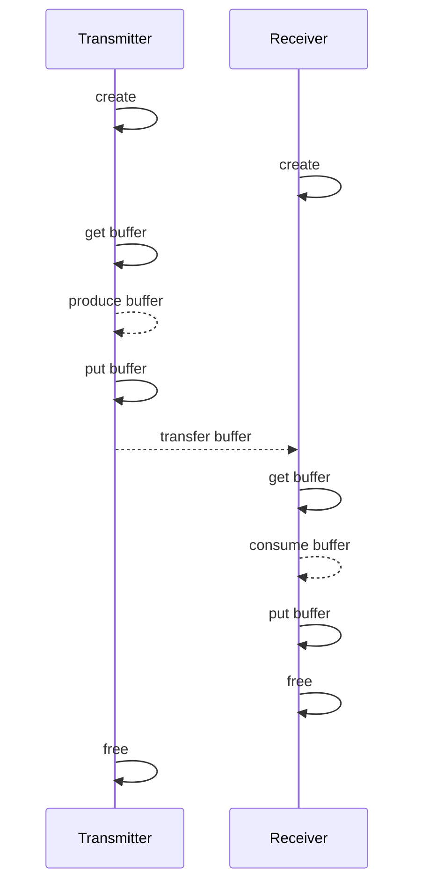

To create a new library based on RDMA for efficient data exchange, especially for media communication mesh (MCM), we must first understand its intended use. MCM facilitates swift data sharing between containers, both within a single node and across multiple nodes. It leverages the Media Transport Library (MTL) for its data path, utilizing the ST2110 stack for large video frame buffers. This requires a DPDK environment where the Network Interface Card (NIC) is bound to a Poll Mode Driver (PMD), preventing kernel use for data paths. A dedicated CPU is also necessary for packet polling, which can be a significant overhead in cloud or edge environments where every computing resource is valuable.

RDMA is an excellent alternative for cross-node data transport as it minimizes CPU intervention and allows the NIC to use the kernel stack for control path operations. Additionally, RDMA's support for GPU memory offers performance benefits for certain media workloads.

**How to Align with MTL API**

To align with MTL’s API, the new library will use `get/put` methods for transmission and reception. In MTL TX, users will:

1. Create a session and then call `tx_get_frame` to retrieve a frame buffer from the library.
2. Fill the buffer with content, either by copying or writing directly to the buffer.
3. After processing, call `tx_put_frame` to signal that the frame is ready for transmission by the library.

The availability of frames for processing depends on the Frames Per Second (FPS) and the total number of frame buffers configured. Users may need to wait if a frame is not immediately available.

In MTL RX, users will:

1. Call `rx_get_frame` to receive a frame buffer when one is available.
2. Use the frame buffer and then call `rx_put_frame` to return it to the library for reuse in subsequent receptions.

**The New API**

The new RDMA-based API extends these capabilities, allowing not just video and audio frames but any data type to be transported. Here are the buffer manipulation APIs:

```c
/**
 * Retrieves a transmission buffer from the transmission session.
 * Must call mtl_rdma_tx_put_buffer to return the buffer once processing is complete.
 *
 * @param handle The handle to the transmission session.
 * @return NULL if no buffer is available, or a pointer to the buffer.
 */
struct mtl_rdma_buffer* mtl_rdma_tx_get_buffer(mtl_rdma_tx_handle handle);

/**
 * Returns a buffer to the transmission session after use.
 *
 * @param handle The handle to the transmission session.
 * @param buffer The buffer obtained from mtl_rdma_tx_get_buffer.
 * @return 0 on success, or a negative error code on failure.
 */
int mtl_rdma_tx_put_buffer(mtl_rdma_tx_handle handle, struct mtl_rdma_buffer* buffer);

/**
 * Retrieves a reception buffer from the reception session.
 * Must call mtl_rdma_rx_put_buffer to return the buffer once processed.
 *
 * @param handle The handle to the reception session.
 * @return NULL if no buffer is available, or a pointer to the buffer.
 */
struct mtl_rdma_buffer* mtl_rdma_rx_get_buffer(mtl_rdma_rx_handle handle);

/**
 * Returns a buffer to the reception session after processing.
 *
 * @param handle The handle to the reception session.
 * @param buffer The buffer obtained from mtl_rdma_rx_get_buffer.
 * @return 0 on success, or a negative error code on failure.
 */
int mtl_rdma_rx_put_buffer(mtl_rdma_rx_handle handle, struct mtl_rdma_buffer* buffer);
```

The buffer is defined as a contiguous block of memory with the following structure:

```c
/** Structure containing buffer metadata. */
struct mtl_rdma_buffer {
  /** Immutable buffer address at runtime. */
  void* addr;
  /** Immutable buffer capacity at runtime. */
  size_t capacity;
  /** Mutable offset of valid data within the buffer. */
  size_t offset;
  /** Mutable size of valid data within the buffer. */
  size_t size;
  /** Sequence number of the buffer. */
  uint32_t seq_num;
  /** Timestamp of the buffer in nanoseconds. */
  uint64_t timestamp;

  /** Space for user-defined metadata. */
  void* user_meta;
  /** Size of the user metadata. */
  size_t user_meta_size;
};
```

This structure includes a reserved area for `user_meta`, allowing users to include custom metadata that can be transported alongside the buffer.

For a visual representation of the API design, please refer to the provided diagram.

